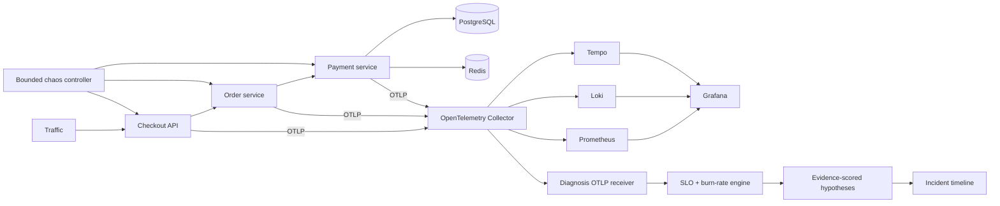
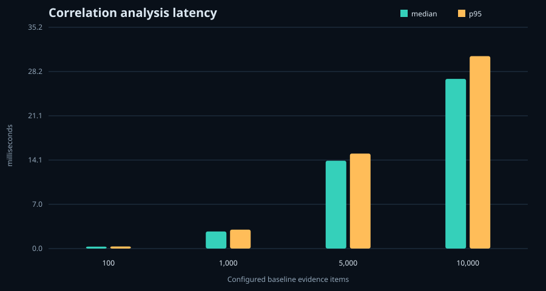

# Incident Lens

**An OpenTelemetry incident lab that turns correlated metrics, logs, traces, and deployments into ranked, evidence-citing failure hypotheses.**

## Break it and watch it explain the failure

```shell
make demo-incident
```

The command builds the Compose stack, generates a healthy checkout baseline,
injects a bounded payment database slowdown, violates the checkout latency SLO,
requests an analysis, saves raw request measurements, and prints the incident
timeline plus ranked hypotheses. It leaves two views running:

- diagnosis and evidence: [http://localhost:8082](http://localhost:8082)
- Grafana metrics, service graph, traces, and logs: [http://localhost:3000/d/incident-lens](http://localhost:3000/d/incident-lens)

The development host used for this repository did not have Docker installed, so
the end-to-end Compose command is implemented but **not runtime-verified here**.
The verified local evidence is listed below; see [limitations](docs/limitations.md).

## Architecture



The Collector is the only application telemetry boundary. Diagnosis receives a
fan-out of the same OTLP payloads stored by the visualization backends; it does
not consume a private application side channel.

## Measured results

Local `CorrelationEngine.analyze` measurements on 2026-08-12, Python 3.12.13,
Windows 11, 4 physical/8 logical CPUs, 30 repetitions per size:

| Configured baseline evidence items | Median | p95 |
|---:|---:|---:|
| 100 | 0.312 ms | 0.453 ms |
| 1,000 | 2.313 ms | 2.456 ms |
| 5,000 | 11.906 ms | 13.786 ms |
| 10,000 | 33.365 ms | 43.508 ms |



These are in-memory algorithm timings, not request throughput or telemetry
ingestion capacity. The 120 samples, hardware, OS, versions, commit, and exact
workload are in [benchmark results](benchmarks/results/local/summary.json) and
[methodology](benchmarks/README.md).

## Why this is difficult

- Correlation identity belongs in traces/logs without creating unbounded metric
  cardinality.
- A causal-looking timeline can be misleading; hypotheses must show supporting
  and contradictory evidence rather than present a score as certainty.
- SLO alerts need multi-window budget burn, while a short demo still needs
  deterministic baseline and incident windows.
- Chaos must reproduce useful faults without privileged access or destabilizing
  the host.
- Metrics, logs, traces, deployments, alerts, and incidents have different delay,
  retention, and query semantics even when they share OpenTelemetry resources.

## Quick start

Prerequisites: Docker Engine with Compose v2, Python 3.11+, and `make` (or invoke
the Python script directly).

```shell
git clone <repository-url>
cd incident-lens
python -m pip install -e ".[dev]"
make demo-incident
```

Without `make`:

```shell
python scripts/demo_incident.py --scenario database-latency
```

Other reproducible scenarios are `bad-deployment`, `memory-pressure`, and
`dependency-outage`. See [chaos testing](docs/chaos-testing.md).

## Implementation details

- FastAPI services propagate W3C trace context via HTTPX instrumentation and a
  stable `x-request-id`; payment creates explicit PostgreSQL and Redis spans.
- JSON logs contain timestamp, severity, service, request ID, trace ID, deployment
  version, and structured error attributes.
- RED metrics plus CPU, memory, queue depth, database latency, and dependency
  errors use bounded labels. Request/order/customer/trace IDs never become labels;
  see the [cardinality policy](docs/architecture.md#cardinality-policy).
- Prometheus evaluates independent multi-window burn alerts. The diagnosis engine
  calculates compliance, consumed/remaining budget, and evidence-linked alerts.
- The owned OTLP receiver parses protobuf traces, metrics, and logs. The ranking
  algorithm, exact scores, window rules, and caveats are documented in
  [root-cause ranking](docs/root-cause-ranking.md).
- Tempo metrics generation feeds the Grafana service graph. Provisioned links
  support trace → logs and trace → metrics navigation; deployment logs annotate
  graphs.

## Tests and CI

```shell
make format
make lint
make test
make build
make security
```

The verified local run passed **13 tests** with **81.88%** coverage over the owned
core selected for unit/API coverage. Tests exercise telemetry parentage and
correlation, malformed OTLP, error attributes, SLO/burn calculations, hypothesis
ranking, evidence citations, bounded chaos, structured logs, and alert/API
validation. Container entrypoint glue is excluded from that percentage and is
handled by the Docker build/Compose CI gate.

GitHub Actions defines separate formatting/lint, tests, package/container build,
Compose validation, dependency audit, and Bandit security jobs. The workflow has
not run remotely from this local repository, so green status is not claimed.

## Benchmarks

```shell
make benchmark
make figures
```

Each run overwrites the named local result set with raw CSV plus a JSON record of
hardware, OS, software versions, commit, configuration, and summaries. Figures
are generated only from that JSON. No optimization claim is made from the current
measurements.

## Engineering decisions

- [Collector fan-out](docs/adr/0001-otel-fanout.md)
- [Bounded chaos](docs/adr/0002-bounded-chaos.md)
- [Transparent heuristics](docs/adr/0003-transparent-heuristics.md)
- [Multi-window burn alerts](docs/adr/0004-multi-window-burn-alerts.md)

Operational references include the [SLO definitions](docs/slo-definitions.md),
[incident runbook](docs/runbook.md), [technical report](docs/technical-report.md),
[architecture](docs/architecture.md), and [Kubernetes extension](deploy/kubernetes/README.md).

## Known limitations

The diagnosis state is in-memory and single-replica; the rule set is fixed and
does not establish statistical causality; authentication, tenancy, TLS, durable
incident storage, and capacity planning are absent. Compose and Kubernetes were
not executable in the authoring environment. Read the complete
[limitations](docs/limitations.md) before evaluating or deploying the project.

## Future work

1. Run and record the Compose acceptance matrix on Linux, then fix any image or
   backend-version incompatibilities revealed by actual execution.
2. Add durable incident/evidence storage, idempotent OTLP ingestion, and HA-safe
   fingerprinting.
3. Add confidence-aware change-point detection and evaluate it against a labeled,
   versioned incident corpus before changing ranking claims.
4. Exercise the Kubernetes manifests in Kind with network policies, secrets,
   PodDisruptionBudgets, and an integration test for rolling deployment markers.

Interview talking points, three CV bullets, a LinkedIn description, and 30-second
and two-minute pitches are in [interview materials](docs/interview-materials.md).
