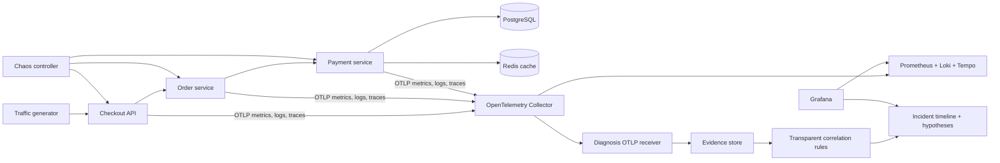

# Architecture

The Collector fans out the same telemetry to the visualization backends and to
the diagnosis service. The diagnosis service parses OTLP protobuf payloads; it
does not use a private side channel from the application. This keeps evidence
visible and makes each hypothesis traceable to input signals.

## Cardinality policy

Metrics use bounded dimensions: service, route template, HTTP method, status
class, dependency, and deployment version. Request IDs, trace IDs, customer IDs,
order IDs, exception messages, and experiment IDs belong in traces or logs—not
metric labels. Deployment version is bounded by the small number of versions
simultaneously deployed; old series still require retention controls in a real
long-lived Prometheus installation.

